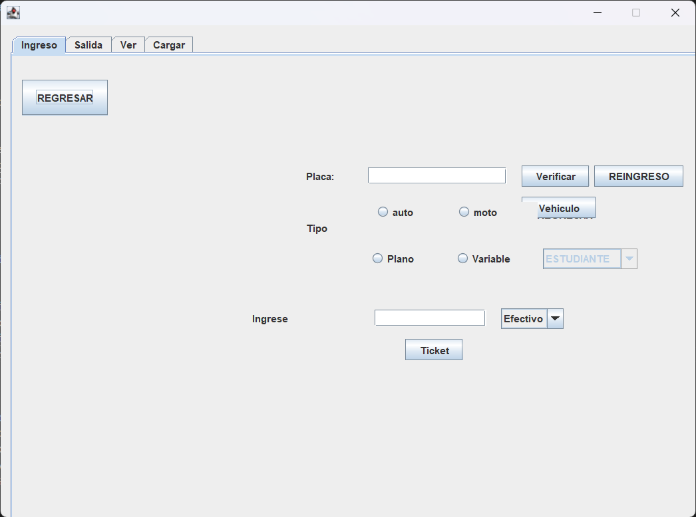
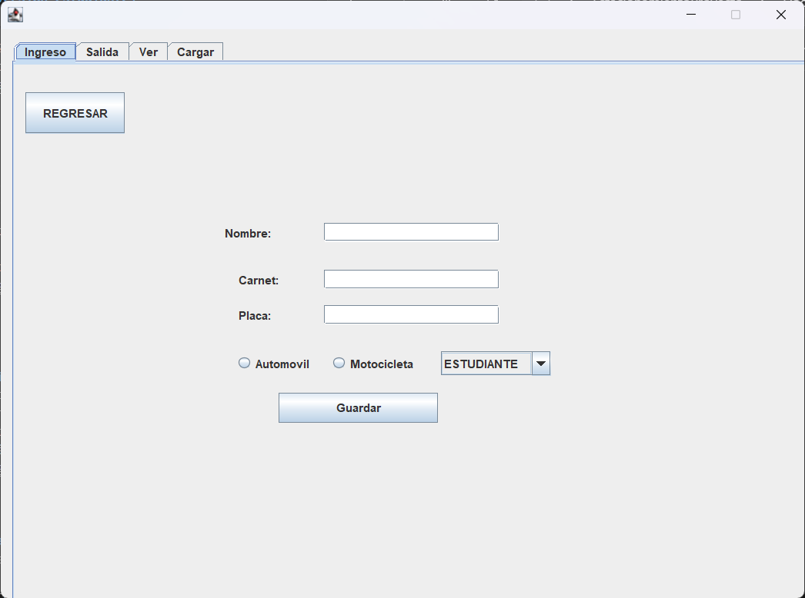
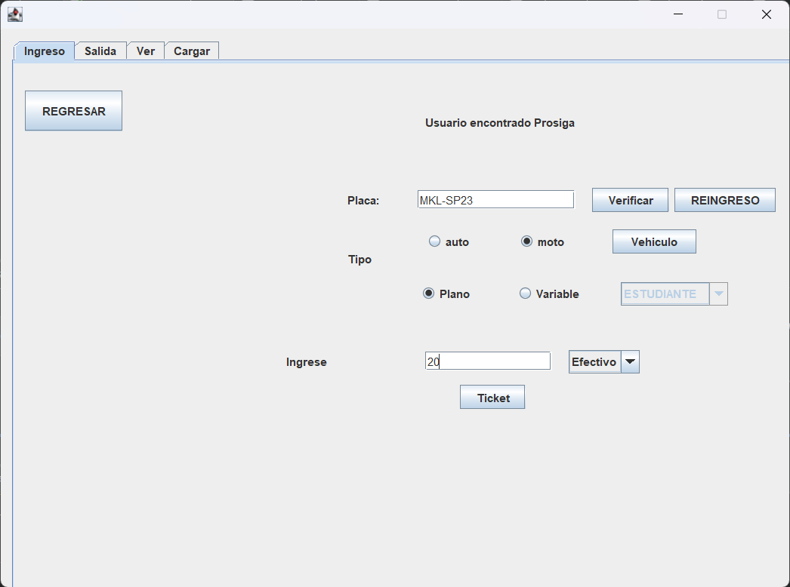
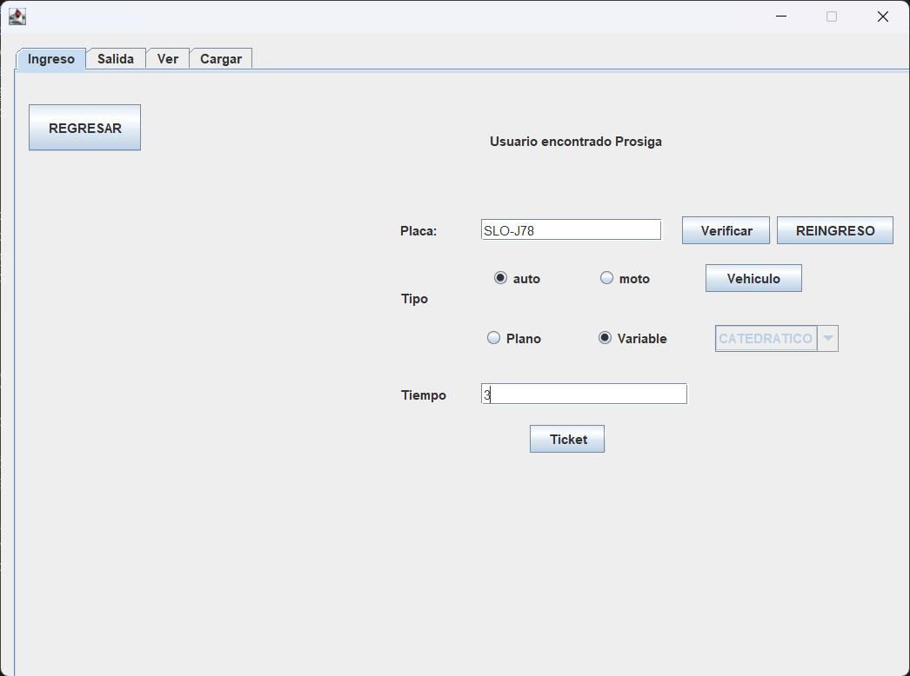
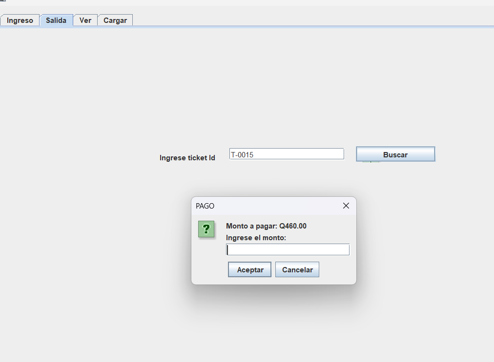
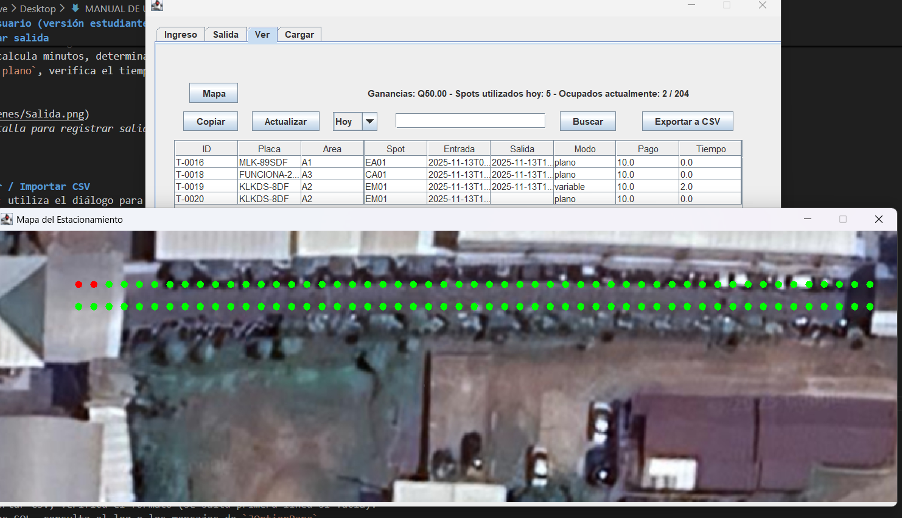

## Manual de Usuario

### 1. Inicio y Login
1. Ejecuta la aplicación.  
2. En la ventana de login introduce:  
   - Empleado:
   - Usuario: `geber12`  
   - Contraseña: `gebr2|`  
   - Admin:
   - Usuario: `ADMIN12`  
   - Contraseña: `geber2|`  
3. Si fallan los intentos, el sistema bloquea temporalmente y muestra barra de progreso.  
  
*Figura 1: Pantalla de inicio de sesión del sistema*

---

### 2. Panel principal (visualizarContenido)
- Paneles principales:  
  - `PanelLogin` — pantalla de ingreso.  
  - `PanelFunciones` — menú principal con pestañas.  
  - `Mapa` — abre `VistaMapa` con el `MapaPanel`.  
  
*Figura 2: Vista general del panel principal con pestañas*

---

### 3. Registrar usuario y vehículo
1. Pulsa “Agregar nuevo usuario”.  
2. Rellena Nombre, Carnet, Placa.  
3. Selecciona tipo (automóvil / moto) y puesto (ESTUDIANTE / CATEDRATICO).  
4. Guardar → se llamará a `UsuarioDB.AgregarDb(Usuario, Vehiculo)` y la UI mostrará mensaje de confirmación.  
  
*Figura 3: Formulario para registrar nuevo usuario y vehículo*

  
*Figura 4: Mensaje de confirmación exitosa*

---

### 4. Buscar por placa
- Ingresa la placa en el campo y pulsa "Buscar".  
- Si existe, se cargan los datos (tipo, puesto) en la tabla.  
- Si no existe, el sistema te ofrece crear un nuevo usuario.  
  
*Figura 5:  Campo de búsqueda y resultados*

---

### 5. Modificar usuario y vehículo
1. Usa la función de búsqueda para encontrar un usuario por su nombre o placa.  
2. La tabla mostrará los datos actuales del usuario y sus vehículos asociados.  
3. Edita directamente en la tabla los campos que quieras modificar: Nombre, Carnet, Placa, TipoVehiculo, Área.  
4. Para guardar los cambios, pulsa el botón “Guardar Cambios”.  
5. El sistema validará que los campos `TipoVehiculo` sean solo “automovil” o “moto”, y `Área` sea “ESTUDIANTE” o “CATEDRATICO”.  
6. Si la validación es correcta, los cambios se guardarán en la base de datos con confirmación.  
7. En caso contrario, mostrará un mensaje de error y no aplicará los cambios.  
  
*Figura 6:  Campo de búsqueda y resultados*
*Nota:* Esta función solo está disponible para usuarios con permisos de administrador.

---

### 6. Generar ticket (ingreso)
1. Escribe la placa.  
2. Selecciona tipo/puesto y modo (plano = tarifa fija; variable = pago por tiempo).  
3. Si `plano`, ingresa billete y confirma — el sistema cobra la tarifa fija.  
4. Si `variable`, ingresa el tiempo estimado.  
5. Pulsa “Generar” → `UsuarioDB.AsignarSpot(...)` realizará:  
   - búsqueda de spot libre,  
   - marcado del spot como `ocupado`,  
   - decremento de capacidad en `Areas`,  
   - inserción del `Ticket` (toda la operación en transacción).  

  
*Figura 7: Formulario para generar nuevo ticket*

---

### 7. Registrar salida
1. En la funcionalidad "Registrar salida" introduce el `TicketID`.  
2. El sistema calcula minutos, determina monto (si `variable`) y libera el spot.  
3. Si modo es `plano`, verifica el tiempo y decide modo espera/expiración según reglas del código.  

  
*Figura 8: Pantalla para registrar salida de vehículo*

---

### 8. Exportar / Importar CSV
- **Exportar**: utiliza el diálogo para elegir carpeta; crea un archivo `tickets_TIMESTAMP.csv`.  
- **Importar**: usa el selector de archivo; `LeerYGuardarCSV` lee y llama a los métodos de inserción según tipo de archivo (áreas, spots, vehículos, tickets).  

  
*Figura 9: Pantalla de exportar/importar datos*

---

### 9. Mapa
- Abre `VistaMapa` (botón `Mapa`).  
- `MapaPanel` dibuja los `PuntoOcupacion` con estado (`libre` / `ocupado` / `espera`).  
- Visual: colores o iconos (según tus imágenes).  

  
*Figura 10: Vista general del mapa de estacionamiento*

---

## Fin