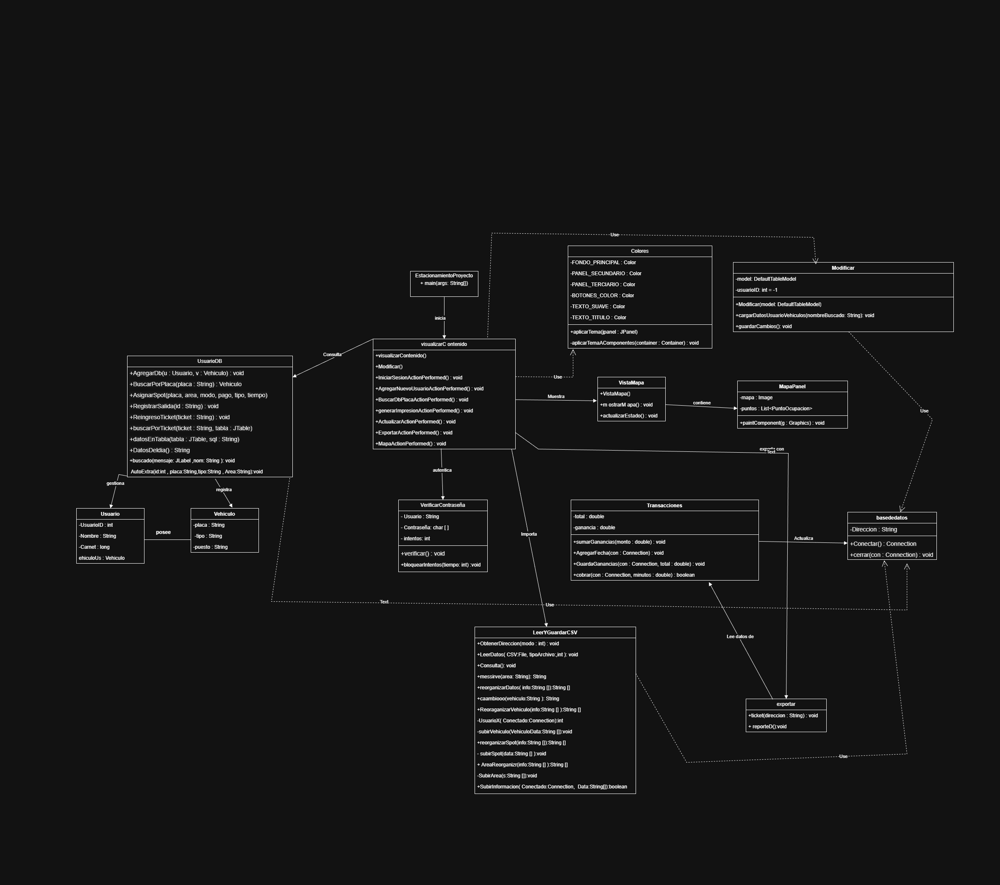

## Manual Técnico

### 1. Resumen técnico
Aplicación desktop en Java, arquitectura en capas:
- **UI**: Swing (`visualizarContenido`, `VistaMapa`, `MapaPanel`).
- **Lógica/Servicios**: `UsuarioDB`, `Transacciones`, `LeerYGuardarCSV`.
- **Modelo/DTO**: `Usuario`, `Vehiculo`, `Ticket` (implícito).
- **Persistencia**: `basededatos` (JDBC + SQLite).

### 2. Lista de clases y responsabilidades

#### `basededatos`
- **Responsabilidad:** abrir/cerrar conexiones JDBC.
- **Atributos/métodos:**
  - `private static final String Direccion` — cadena JDBC `jdbc:sqlite:...`.
  - `public static Connection Conectar()` — devuelve `Connection`.
  - `public static void cerrar(Connection)` — cerrar `Connection`.
- **Consideraciones:** no maneja pool; cada DAO abre/ cierra conexión localmente.

#### `Usuario` (DTO)
- **Atributos:** `UsuarioID`, `Nombre`, `Carnet`, `vehiculoUs`.
- **Responsabilidad:** transportar datos entre capas.

#### `Vehiculo` (DTO)
- **Atributos:** `placa`, `Tipo`, `puesto`.
- **Responsabilidad:** modelo del dominio.

#### `UsuarioDB` (DAO / Service mixto)
- **Responsabilidades principales:**
  - `AgregarDb(Usuario, Vehiculo)` — inserta usuario, obtiene generated keys, inserta vehículo con FK.
  - `BuscarPorPlaca(String)` — SELECT en `vehiculo`.
  - `AsignarSpot(...)` — flujo complejo:
    - Verifica si placa ya tiene ticket activo.
    - Consulta `Areas` para capacidad.
    - Busca `Spots` libres y marca ocupado.
    - Si modo `plano` cobra y registra mediante `Transacciones`.
    - Inserta `Ticket` (genera ticket con `GenerarTicket(Conectado)`).
    - Usa transacción (`setAutoCommit(false)` / `commit()` / `rollback()`).
  - `RegistrarSalida(ticketid)` — calcula duración, maneja modos `plano`/`variable`, libera spot, actualiza área, inserta fecha salida.
  - `ReingresoTicket(ticketid)` — permite reingreso si tiempo permitido.
  - `datosEnTabla(JTable, sql)` — llena una `DefaultTableModel` con resultados.
  - `DatosDeldia()` — obtiene ganancias del día y totales de spots.
- **Puntos críticos:**
  - Uso repetido de `setAutoCommit(false)` y `commit()`; asegura atomicidad.
  - Si hay excepciones, hace `rollback()`.
  - Obtención de `GeneratedKeys` importante para FK.

#### `Transacciones`
- **Responsabilidades:**
  - `sumarGanancias(double)`, `AgregarFecha(Connection)`, `GuardaGanancias(Connection,double)`.
  - `planoCobro(Connection,double)` — maneja tarifa fija (Q10), muestra `JOptionPane` y actualiza `Actividad`.
  - `cobrar(Connection,double minutos)` — calcula monto por tiempo (tarifa hora redondeada), solicita pago (InputDialog) y actualiza `Actividad`.
- **Notas:** mezcla UI (`JOptionPane`) y lógica, lo que dificulta tests unitarios.

#### `LeerYGuardarCSV`
- **Responsabilidad:** leer CSV con `BufferedReader`, saltar primera línea, `split(",")`, llamar a funciones que adaptan datos y luego a los métodos que insertan al DB (`SubirArea`, `subirSpot`, `subirVehiculo`, `SubirInformacion`).
- **Limpieza:** contiene transformaciones (normaliza tipos, áreas, estado `FREE/AVAILABLE` → `libre`, etc).

#### `exportar`
- **Responsabilidad:** `ticket(String direccion)` — realiza `SELECT * FROM Ticket`, usa `ResultSetMetaData` para escribir encabezados y filas en archivo con `PrintWriter`.

#### `visualizarContenido` (UI principal)
- **Responsabilidad:** ventana `JFrame` con todos los paneles y acciones (botones).
- **Eventos importantes:** `IniciarSesionActionPerformed` (instancia `VerificarContraseña` y llama `verificar()`), `AgregarNuevoUsuarioActionPerformed` (crea `Usuario` y `Vehiculo`, llama `UsuarioDB.AgregarDb`), `generarImpresionActionPerformed` (llama `UsuarioDB.AsignarSpot`), `BuscarDbPlacaActionPerformed`, `ExportarActionPerformed`, `Seleccionar` (importar CSV).
- **Uso de timers:** bloqueo de intentos en `VerificarContraseña`.

### `colores` (Utilidad de Estilos / Tema Visual)
- **Responsabilidad:** aplicar un tema visual consistente a todo el sistema Swing.
- **Atributos (colores constantes):**
  - `FONDO_PRINCIPAL : Color`
  - `PANEL_SECUNDARIO : Color`
  - `PANEL_TERCIARIO : Color`
  - `BOTONES_COLOR : Color`
  - `TEXTO_SUAVE : Color`
  - `TEXTO_TITULO : Color`
- **Métodos clave:**
  - `public static void aplicarTema(JFrame frame)` — aplica el tema al frame principal.
  - `private static void aplicarTemaAComponentes(Container container)` — recorre recursivamente todos los componentes Swing y aplica colores según el tipo: `JPanel`, `JButton`, `JLabel`, `JTextField`, `JTable`, etc.

#### `VerificarContraseña`
- **Responsabilidad:** comparar `char[] contraseña` con `contra` interno y `usuario` con `us`. Maneja `intentos`, bloqueo con `Timer`, manipula visibilidad de paneles (UI).
- **Seguridad:** credenciales hardcodeadas.

#### `VistaMapa` y `MapaPanel`
- `VistaMapa` crea ventana que contiene `MapaPanel`.
- `MapaPanel` dibuja el mapa con `paintComponent`, itera `puntos : List<PuntoOcupacion]` y dibuja iconos según estado.

### 3. Base de datos (esquema)
Tablas principales :

- **Usuario** (`UsuarioID` INTEGER PK, `Nombre`, `Carnet` INT)
- **Vehiculo** (`Placa` TEXT PK, `TipoVehiculo` TEXT, `Area` TEXT, `Usuarioid` INT FK)
- **Ticket** (`TicketID` TEXT PK, `Placa`, `IdArea`, `Spotid`, `FechaIngreso`, `Fechasalida`, `modo`, `monto`, `TiempoPagado`)
- **Spots** (`PosicionID` TEXT PK, `AreaID` TEXT, `Tipo_vehiculo`, `Estado`)
- **Areas** (`Id` TEXT PK, `Capacidad` INT)
- **Actividad** (`Fecha` DATE PRIMARY KEY, `GananciaTotal` REAL, `SpotsUtilizados` INT)

### 4. Flujo de datos (ejemplo: AsignarSpot)

1. UI crea `Usuario`/`Vehiculo` DTO o lee placa.
2. Llama `UsuarioDB.AsignarSpot(placa, idarea, modo, pago, vehiculo, tiempo)`.
3. `AsignarSpot`:
   - Abre conexión `basededatos.Conectar()`.
   - `setAutoCommit(false)`.
   - Verifica ticket activo (SELECT COUNT).
   - Consulta `Areas.Capacidad`.
   - Selecciona `Spots` libres `LIMIT 1`.
   - Si modo `plano` llama `Transacciones.planoCobro(Conectado,pago)`; si falla, `rollback()`.
   - Actualiza `Spots` (estado='ocupado') y `Areas` (Capacidad -1).
   - Inserta `Ticket`.
   - `commit()`.

### 5. Errores comunes y manejo
- **SQLExceptions**: capturadas y mostradas con `JOptionPane`. Muchas funciones usan `try-with-resources`.
- **Rollback** es empleado cuando detecta condiciones inválidas o excepciones, protegiendo la consistencia.
- **Validaciones UI**: poco robustas (por ejemplo parseLong sin catch específico). Se recomienda validar entradas antes de parsear.

### 6. Puntos de mejora 
- **Separar UI y lógica**: extraer lógica de cobro y DB fuera de clases que manejan `JOptionPane`.
- **Configurar credenciales en DB** en vez de hardcodear en `VerificarContraseña`.
- **Pool de conexiones** o `DataSource` para eficiencia.
- **Clases DAO separadas** por entidad (`TicketDAO`, `SpotDAO`, `AreaDAO`) para limpiar `UsuarioDB`.
- **Pruebas unitarias**: extraer lógica pura (cálculo de monto) en métodos testables.
- **Internacionalización**: mensajes en propiedades.
- **Manejo de concurrencia**: si se usa multi-hilo (Timers), sincronizar acceso a DB.

### 7. Casos de prueba sugeridos
- Registrar usuario con datos válidos/ inválidos.
- Insertar vehículo con placa repetida.
- Generar ticket para placa con ticket activo (debe bloquear).
- Registrar salida en modo `plano` y `variable`.
- Importar CSV con filas mal formadas.
- Exportar y verificar encabezados y filas.

### 8. Cómo extender el proyecto 
- Añadir login con roles (ADMIN / EMPLEADO) desde DB.
- UI responsive con JavaFX (mejor que Swing).
- API REST para exponer datos (permitir dashboard web).
- Reporting (PDF) y gráficos (ganancias por día).

### 9. Anexos
- Compilar: `javac -cp ".:sqlite-jdbc.jar" -d out $(find src -name "*.java")`
- Ejecutar: `java -cp "out:sqlite-jdbc.jar" com.mycompany.estacionamientoproyecto.visualizarContenido`

---

## Fin del paquete de entrega